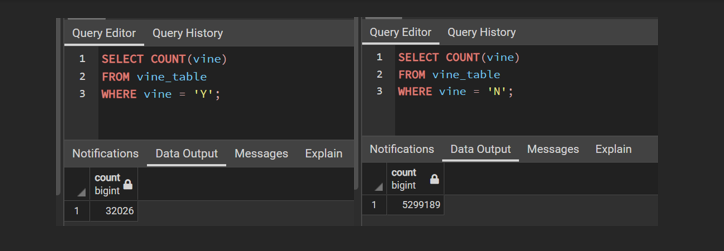
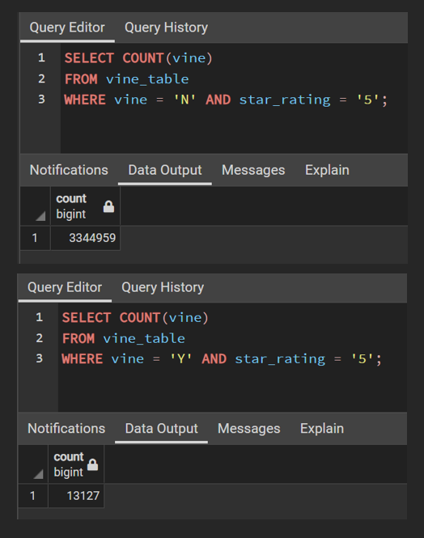
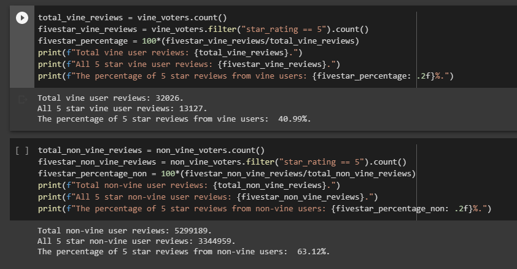
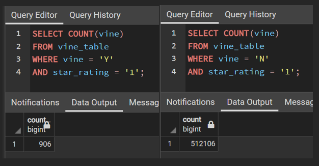

# Amazon_Vine_Analysis Overview
The Amazon Vine program is a fee based program that allows manufactures and publishers to receive reviews for their 
products. The Vine members are sent products to review and in turn are required to publish the reivew. The analysis 
is designed to reflect the results of a number of products to determine biases based on being a vine member. 

- software: Google Colab | PgAdmin 

# Amazon_Vine_Analysis Results
The analysis was run in two environments - SQL based PgAdmin and Google Colab, both working together as depicted 
in the images below:

#### *Vine User overall data:*
  - Total reviews: 32,026
  - 5-star reviews: 13,127
  - 5-star review percentage: 40.99%

#### *Non-vine User overall data:*
- Total reviews: 5,299,189
- 5-star reviews: 3,344,959
- 5-star review percentage: 63.12%
- 
 ### Results with images:
- How many Vine reviews and non-Vine reviews were there?
  - Vine user reviews: 32,026 and Non-vine user reviews: 5,299,189
  - 
- How many Vine reviews were 5 stars? How many non-Vine reviews were 5 stars?
  - Vine user 5-star reviews: 13,127 and Non-vine user 5 star reviews: 3,344,959
  - 
- What percentage of Vine reviews were 5 stars? What percentage of non-Vine reviews were 5 stars?
  - Vine user 5-star review percentage: 40.99% and Non-vine user 5 star review percentage: 63.12%
  - 

# Amazon_Vine_Analysis Summary

### Biases findings:
It clearly shows a larger percentage of 5-star ratings among non-vine users which is a good reflection that a
biases based on the fee does not apply. If we were to assume that "paying" for reviews would result in a larger 
percentage of 5-star reviews than we would see those numbers flipped. In this case we see less than 50% of the 
overall vine user reviews were 5-star which indicates they are not pressured into writing fabricated biased reviews.

### Additional Analysis recommendation:
An additional analysis was run on 1-star reviews to reflect the difference in numbers:

- As shown there are 906 1-star reviews among Vine users and 512,106 among Non-vine users - this comes to a 
percentage variance of 2.82% for Vine users and 9.66% for Non-vine users. We can deduce that the overall numbers
for Non-vine users help to reflect a larger percentage for ratings in general. And in those numbers we can see that
there is no true exaggerated biases for either group that stands out in a way that would suggest Vine users are 
paid to write dishonest reviews. 

- In addition we could run an analysis on all vine users across the board in every category comparing their 5-star
rating percentages to see if different industries stand out as potential biased review captures. 
